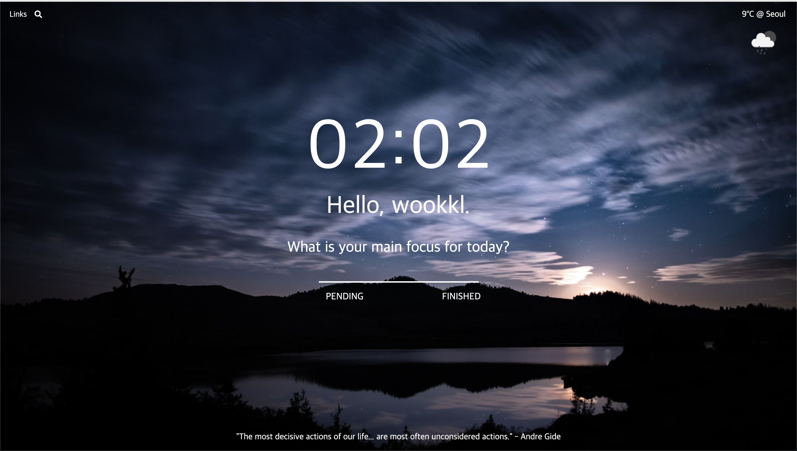

# momonton 
>  A clone of the productivity chrome app Momentum on Vanilla jS

![HTML Version][html-image]
![CSS Version][css-image]

## Feature
- [x] Clock
- [x] To Do List
- [x] Weather
- [x] Daily Quote
- [x] Daily Photo[(Using unsplash api)](https://source.unsplash.com/)
- [x] Offline Support

## Try it out
[https://wookkl.github.io/momonton/](https://wookkl.github.io/momonton/)

[html-image]: https://img.shields.io/badge/html-v5-brightgreen
[css-image]: https://img.shields.io/badge/CSS-v3-orange